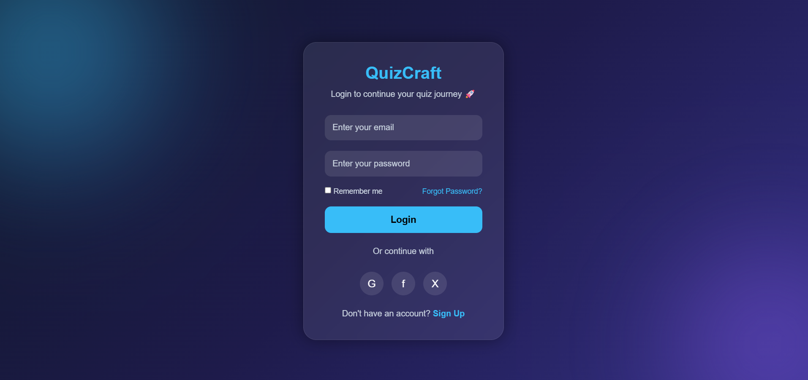
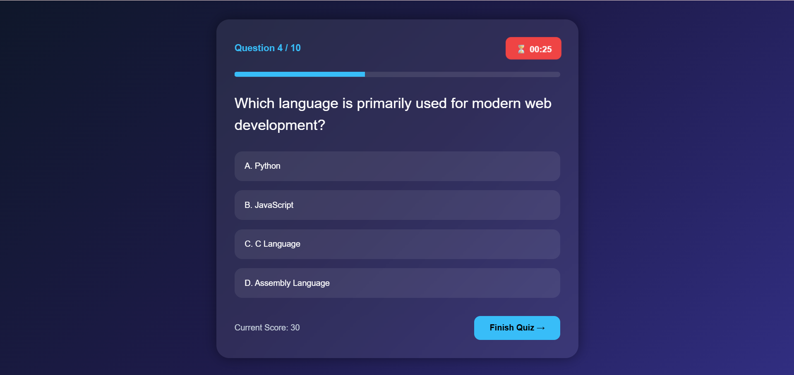
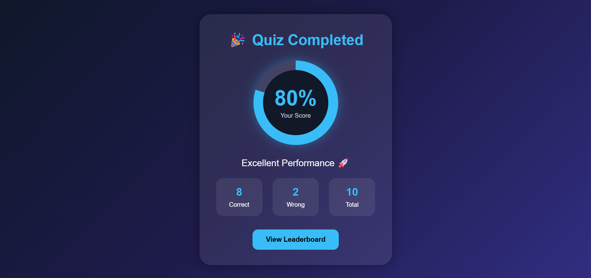
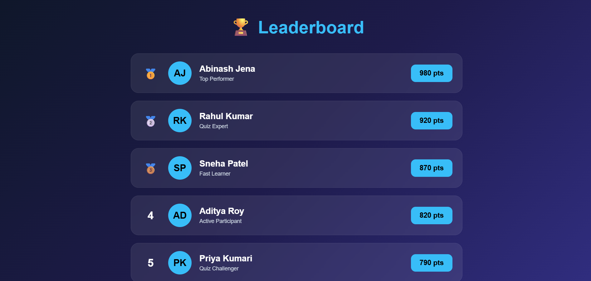

# 🎯 QuizCraft - Online Quiz System

An Online Quiz and Competitive Exam Platform built using HTML, CSS, JavaScript, Python Flask, and MySQL.

---
## 📸 Project Preview

### 🏠 Homepage
[](https://abinashjena2006.github.io/QuizCraft/)

---

## 🔐 Login Page

[🔗 Open Login Page](https://abinashjena2006.github.io/QuizCraft/frontend/login.html)

[](https://abinashjena2006.github.io/QuizCraft/frontend/login.html)

---

## 🎯 Quiz Page

[🔗 Open Quiz Page](https://abinashjena2006.github.io/QuizCraft/frontend/quiz.html)

[](https://abinashjena2006.github.io/QuizCraft/frontend/quiz.html)

---

## 📊 Result Page

[🔗 Open Results](https://abinashjena2006.github.io/QuizCraft/frontend/result.html)

[](https://abinashjena2006.github.io/QuizCraft/frontend/result.html)


---

## 🏆 Leaderboard

[🔗 Open Leaderboard](https://abinashjena2006.github.io/QuizCraft/frontend/leaderboard.html)

[](https://abinashjena2006.github.io/QuizCraft/frontend/leaderboard.html)

---


## 👨‍💼 Admin Dashboard

[🔗 Open Admin Dashboard](https://abinashjena2006.github.io/QuizCraft/frontend/admin.html)

[](https://abinashjena2006.github.io/QuizCraft/frontend/admin.html)

---


## ✨ Features : 
- User Login & Registration
- Multiple Choice Questions
- Timer Based Quiz
- Instant Result Generation
- Admin Panel
- Score Tracking

---

## 🛠️ Tech Stack
Frontend:
- HTML
- CSS
- JavaScript

Backend:
- Python Flask

Database:
- MySQL

---

## 📁 Project Structure

```bash
Online-quiz-system/
│── frontend/
│── backend/
│── database/
│── assets/
│── README.md
```

---

## 🚀 Future Enhancements
- AI Based Quiz Recommendation
- Leaderboard System
- Dark Mode
- Live Quiz Competition
- Certificate Generation

---

## 👨‍💻 Author
Abinash Jena 
